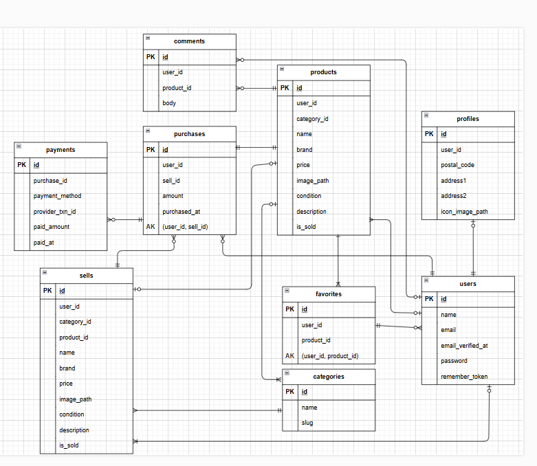

# Free-market

## 環境構築
- Free-marketホーム画面 http://localhost/
- 会員登録画面　http://localhost/register
- phpMyAdmin http://localhost:8080/

### Dockerビルド
- git clone https://github.com/simanuki0923/Free-market.git
- cd Free-market
- docker compose up -d --build

### Laravel環境構築
- docker-compose exec php bash
- composer install
- cp .env.example .env
- .env環境設定変更
DB_CONNECTION=mysql
DB_HOST=mysql
DB_PORT=3306
DB_DATABASE=laravel_db
DB_USERNAME=laravel_user
DB_PASSWORD=laravel_pass
- php artisan key:generate
- php artisan migrate
- php artisan db:seed

- .env設定変更設定
APP_LOCALE=ja
APP_FALLBACK_LOCALE=ja
APP_FAKER_LOCALE=ja_JP

QUEUE_CONNECTION=sync
CACHE_STORE=file

MAIL_MAILER=smtp
MAIL_HOST=smtp.gmail.com
MAIL_PORT=587
MAIL_USERNAME=gmailアドレス設定
MAIL_PASSWORD=Goodleアプリパスワード作成入力
MAIL_ENCRYPTION=tls
MAIL_FROM_ADDRESS=gmailアドレス設定
MAIL_FROM_NAME="${APP_NAME}"

MAIL_STREAM_ALLOW_SELF_SIGNED=true
MAIL_STREAM_VERIFY_PEER=false

STRIPE_SECRET_KEY= # stripeのSECRET_KEY入力
STRIPE_PUBLIC_KEY= # stripeのPUBLIC_KEY入力

## 使用技術
- docker
- Laravel 12.X
- PHP 8.x
- mysql 8.4
- nginx 1.28
- fortify1.30
- stripe15.8

## ER図

