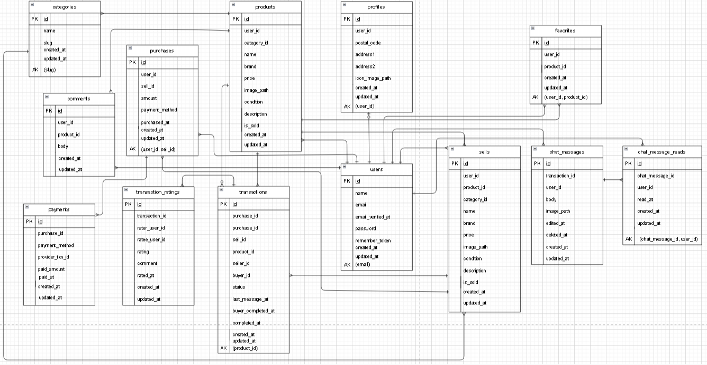

# coachtechフリマ

Laravel + Docker（Nginx / PHP / MySQL）で動くフリマアプリです。
各ユーザー同士で商品出品、商品購入、購入時取引チャット機能を実装しています。

---

## 環境構築
- Free-marketホーム画面 http://localhost/
- 会員登録画面　http://localhost/register
- phpMyAdmin http://localhost:8080/

---

### Dockerビルド
- git clone https://github.com/simanuki0923/Free-market.git
- cd Free-market
- docker compose up -d --build

---

## テストアカウント
- name: デモ出品者A（1-5）
- email: demo-seller-a@example.com
- password: password
- name: デモ出品者B（6-10）
- email: demo-seller-b@example.com
- password: password
- name: デモ未紐づけユーザ（購入確認兼用）
- email: demo-idle-user@example.com
- password: password

```
### Dockerビルド
- git clone https://github.com/simanuki0923/Free-market.git
- cd Free-market
- docker compose up -d --build
```

### Laravel環境構築

```
- sudo chmod -R 777 src/*
- cp src/.env.local src/.env
- sudo chmod -R 777 src/.env
- docker-compose exec php bash
- composer install
- php artisan key:generate
- php artisan storage:link
- chmod -R ug+rw storage bootstrap/cache
- php artisan migrate
- php artisan db:seed
- exit
```

### .env設定設定変更
```
- code .
- SESSION_DRIVER=file
- QUEUE_CONNECTION=sync
- CACHE_STORE=file
```

## 使用技術
- docker
- Laravel 12.X
- PHP 8.x
- mysql 8.4
- nginx 1.28
- fortify1.30
- stripe15.8
- mailtrap

## テーブル仕様

### users テーブル

| カラム名 | 型 | primary key | unique key | not null | foreign key |
|---|---|---|---|---|---|
| id | bigint | PK |  | ○ |  |
| name | string |  |  | ○ |  |
| email | string |  | UNIQUE | ○ |  |
| email_verified_at | timestamp |  |  |  |  |
| password | string |  |  | ○ |  |
| remember_token | string(100) |  |  |  |  |
| created_at | timestamp |  |  | ○ |  |
| updated_at | timestamp |  |  | ○ |  |

---

### categories テーブル

| カラム名 | 型 | primary key | unique key | not null | foreign key |
|---|---|---|---|---|---|
| id | bigint | PK |  | ○ |  |
| name | string |  |  | ○ |  |
| slug | string |  | UNIQUE | ○ |  |
| created_at | timestamp |  |  | ○ |  |
| updated_at | timestamp |  |  | ○ |  |

---

### profiles テーブル

| カラム名 | 型 | primary key | unique key | not null | foreign key |
|---|---|---|---|---|---|
| id | bigint | PK |  | ○ |  |
| user_id | bigint |  | UNIQUE | ○ | users.id |
| postal_code | string(16) |  |  |  |  |
| address1 | string |  |  |  |  |
| address2 | string |  |  |  |  |
| icon_image_path | string |  |  |  |  |
| created_at | timestamp |  |  | ○ |  |
| updated_at | timestamp |  |  | ○ |  |

---

### products テーブル

| カラム名 | 型 | primary key | unique key | not null | foreign key |
|---|---|---|---|---|---|
| id | bigint | PK |  | ○ |  |
| user_id | bigint |  |  | ○ | users.id |
| category_id | bigint |  |  |  | categories.id |
| name | string |  |  | ○ |  |
| brand | string |  |  |  |  |
| price | unsignedInteger |  |  | ○ |  |
| image_path | string |  |  |  |  |
| condition | string(50) |  |  |  |  |
| description | text |  |  |  |  |
| is_sold | boolean default false |  |  | ○ |  |
| category_ids_json | text |  |  |  |  |
| created_at | timestamp |  |  | ○ |  |
| updated_at | timestamp |  |  | ○ |  |

---

### favorites テーブル

| カラム名 | 型 | primary key | unique key | not null | foreign key |
|---|---|---|---|---|---|
| id | bigint | PK |  | ○ |  |
| user_id | bigint |  |  | ○ | users.id |
| product_id | bigint |  |  | ○ | products.id |
| created_at | timestamp |  |  | ○ |  |
| updated_at | timestamp |  |  | ○ |  |
| (複合) user_id, product_id |  |  | UNIQUE |  |  |

---

### comments テーブル

| カラム名 | 型 | primary key | unique key | not null | foreign key |
|---|---|---|---|---|---|
| id | bigint | PK |  | ○ |  |
| user_id | bigint |  |  | ○ | users.id |
| product_id | bigint |  |  | ○ | products.id |
| body | string(255) |  |  | ○ |  |
| created_at | timestamp |  |  | ○ |  |
| updated_at | timestamp |  |  | ○ |  |

---

### sells テーブル

| カラム名 | 型 | primary key | unique key | not null | foreign key |
|---|---|---|---|---|---|
| id | bigint | PK |  | ○ |  |
| user_id | bigint |  |  | ○ | users.id |
| product_id | bigint |  |  |  | products.id |
| category_id | bigint |  |  |  | categories.id |
| name | string |  |  | ○ |  |
| brand | string |  |  |  |  |
| price | unsignedInteger |  |  | ○ |  |
| image_path | string |  |  |  |  |
| condition | string(50) |  |  |  |  |
| description | text |  |  |  |  |
| is_sold | boolean default false |  |  | ○ |  |
| category_ids_json | text |  |  |  |  |
| created_at | timestamp |  |  | ○ |  |
| updated_at | timestamp |  |  | ○ |  |

---

### purchases テーブル

| カラム名 | 型 | primary key | unique key | not null | foreign key |
|---|---|---|---|---|---|
| id | bigint | PK |  | ○ |  |
| user_id | bigint |  |  | ○ | users.id |
| sell_id | bigint |  |  | ○ | sells.id |
| amount | unsignedInteger |  |  | ○ |  |
| payment_method | string(50) |  |  | ○ |  |
| purchased_at | timestamp default current |  |  | ○ |  |
| created_at | timestamp |  |  | ○ |  |
| updated_at | timestamp |  |  | ○ |  |
| (複合) user_id, sell_id |  |  | UNIQUE |  |  |

---

### payments テーブル

| カラム名 | 型 | primary key | unique key | not null | foreign key |
|---|---|---|---|---|---|
| id | bigint | PK |  | ○ |  |
| purchase_id | bigint |  |  | ○ | purchases.id |
| payment_method | enum(convenience_store, credit_card, bank_transfer) |  |  | ○ |  |
| provider_txn_id | string |  |  |  |  |
| paid_amount | unsignedInteger |  |  | ○ |  |
| paid_at | timestamp |  |  |  |  |
| created_at | timestamp |  |  | ○ |  |
| updated_at | timestamp |  |  | ○ |  |

---

### transactions テーブル

| カラム名 | 型 | primary key | unique key | not null | foreign key |
|---|---|---|---|---|---|
| id | bigint | PK |  | ○ |  |
| purchase_id | bigint |  | UNIQUE | ○ | purchases.id |
| sell_id | bigint |  |  | ○ | sells.id |
| product_id | bigint |  |  | ○ | products.id |
| seller_id | bigint |  |  | ○ | users.id |
| buyer_id | bigint |  |  | ○ | users.id |
| status | string(30) default ongoing |  |  | ○ |  |
| last_message_at | timestamp |  |  |  |  |
| buyer_completed_at | timestamp |  |  |  |  |
| completed_at | timestamp |  |  |  |  |
| created_at | timestamp |  |  | ○ |  |
| updated_at | timestamp |  |  | ○ |  |

---

### chat_messages テーブル

| カラム名 | 型 | primary key | unique key | not null | foreign key |
|---|---|---|---|---|---|
| id | bigint | PK |  | ○ |  |
| transaction_id | bigint |  |  | ○ | transactions.id |
| user_id | bigint |  |  | ○ | users.id |
| body | text |  |  | ○ |  |
| image_path | string |  |  |  |  |
| edited_at | timestamp |  |  |  |  |
| deleted_at | timestamp (softDeletes) |  |  |  |  |
| created_at | timestamp |  |  | ○ |  |
| updated_at | timestamp |  |  | ○ |  |

---

### chat_message_reads テーブル

| カラム名 | 型 | primary key | unique key | not null | foreign key |
|---|---|---|---|---|---|
| id | bigint | PK |  | ○ |  |
| chat_message_id | bigint |  |  | ○ | chat_messages.id |
| user_id | bigint |  |  | ○ | users.id |
| read_at | timestamp |  |  |  |  |
| created_at | timestamp |  |  | ○ |  |
| updated_at | timestamp |  |  | ○ |  |
| (複合) chat_message_id, user_id |  |  | UNIQUE |  |  |

---

### transaction_ratings テーブル

| カラム名 | 型 | primary key | unique key | not null | foreign key |
|---|---|---|---|---|---|
| id | bigint | PK |  | ○ |  |
| transaction_id | bigint |  |  | ○ | transactions.id |
| rater_user_id | bigint |  |  | ○ | users.id |
| ratee_user_id | bigint |  |  | ○ | users.id |
| rating | unsignedTinyInteger |  |  | ○ |  |
| comment | string(500) |  |  |  |  |
| rated_at | timestamp |  |  |  |  |
| created_at | timestamp |  |  | ○ |  |
| updated_at | timestamp |  |  | ○ |  |
| (複合) transaction_id, rater_user_id |  |  | UNIQUE |  |  |
---

## ER図


---

## PHPUnitテスト

```
docker compose exec php bash
php artisan test tests/Feature
```